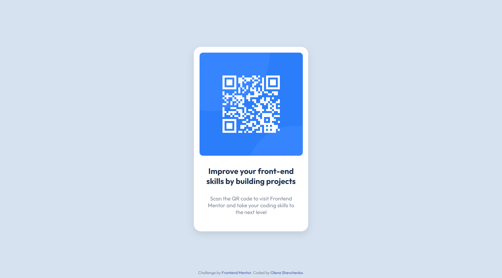

# Frontend Mentor - QR code component solution

This is a solution to the [QR code component challenge on Frontend Mentor](https://www.frontendmentor.io/challenges/qr-code-component-iux_sIO_H). Frontend Mentor challenges help you improve your coding skills by building realistic projects. 

## Table of contents

  - [Screenshot](#screenshot)
  - [Links](#links)
  - [Built with](#built-with)
- [Author](#author)

## Overview

It was a great task to practice more with flexboxes and images.

### Screenshot

### Links

- Solution URL: [Add solution URL here](https://your-solution-url.com)
- Live Site URL: [Add live site URL here](https://your-live-site-url.com)

### Built with

- Semantic HTML5 markup
- SCSS 
- Flexbox
- CSS Grid
- Mobile-first workflow

## Author

- Website - [Olena Shevchenko](https://github.com/olenahelena?tab=repositories)
- Frontend Mentor - [@olenahelena](https://www.frontendmentor.io/profile/olenahelena)